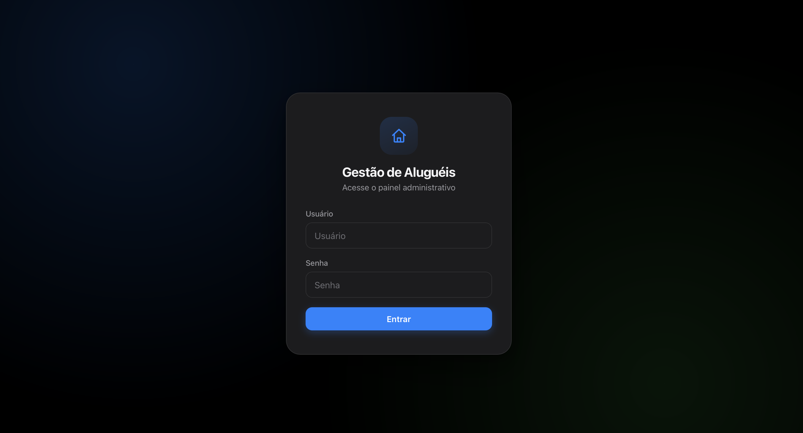

# Sistema de Gerenciamento de Aluguéis

Aplicação web para controlar imóveis, contratos de aluguel, pagamentos, atrasos, despesas e
relatórios — pensada para donos de imóveis ou pequenas imobiliárias que só precisam de um
lugar central para acompanhar tudo isso, sem depender de planilhas.

Não usa nenhuma biblioteca externa, nenhum banco de dados e nenhum framework: é só
**HTML + CSS + JavaScript** no navegador e **PHP puro** no servidor, salvando tudo em
arquivos `.json`. Isso significa que dá pra hospedar em qualquer hospedagem compartilhada
comum (Hostinger, cPanel, etc.) e acessar de qualquer lugar pela internet.



## Índice

- [Acesso padrão (leia antes de usar)](#acesso-padrão-leia-antes-de-usar)
- [Como rodar no seu computador](#como-rodar-no-seu-computador)
- [Como colocar no ar (hospedagem)](#como-colocar-no-ar-hospedagem)
- [O que o sistema faz](#o-que-o-sistema-faz)
- [Perguntas frequentes](#perguntas-frequentes)
- [Para quem quer entender o código](#para-quem-quer-entender-o-código)

## Acesso padrão (leia antes de usar)

Na primeira vez que o sistema roda, ele cria automaticamente um usuário administrador com:

```
Usuário: admin
Senha:   12345678
```

> ⚠️ **Troque essa senha imediatamente após o primeiro login.** Vá em **Configurações →
> Conta do administrador**, informe a senha atual (`12345678`) e cadastre um usuário e senha
> só seus. Enquanto isso não for feito, qualquer pessoa que souber a URL do sistema e essas
> credenciais padrão consegue entrar.

Não existe recuperação de senha por e-mail (o sistema não envia e-mails). Se esquecer a
senha depois de trocada, é preciso apagar o arquivo `data/auth.json` no servidor para que
ele volte a ser recriado com o padrão `admin` / `12345678` no próximo acesso.

## Como rodar no seu computador

Pré-requisito: ter o **PHP instalado** (versão 7.4 ou mais nova). Para verificar, abra o
terminal e digite `php -v`.

1. Baixe/clone este repositório
2. Abra o terminal na pasta do projeto
3. Rode:
   ```bash
   php -S localhost:8000
   ```
4. Acesse `http://localhost:8000` no navegador
5. Faça login com `admin` / `12345678` (veja o aviso acima)

Não precisa instalar nada com `npm`, `composer` ou qualquer outro gerenciador de pacotes —
o projeto não tem dependências.

> Nota: o servidor embutido do PHP (`php -S`) ignora o arquivo `.htaccess`, então localmente
> a pasta `data/` não fica bloqueada por URL. Isso só funciona de verdade com Apache (veja a
> seção de hospedagem abaixo).

## Como colocar no ar (hospedagem)

Este sistema foi feito para hospedagem compartilhada comum com **PHP + Apache** (cPanel,
Hostinger, etc.) — não precisa de VPS nem de conhecimento avançado de servidor.

1. **Envie os arquivos**: copie a pasta inteira do projeto (`index.html`, `index.js`,
   `ui.js`, `css/`, `api/`, `data/`, `contratos/`) para a hospedagem, mantendo a mesma
   organização de pastas
2. **Acesse pelo navegador** e faça login com `admin` / `12345678`
3. **Troque a senha na hora**, como explicado na seção acima
4. **Gere uma chave de segurança própria**: vá em **Configurações → Segurança** e clique em
   "Gerar novo COOKIE_SECRET" (protege o cookie de login contra falsificação). Também dá
   pra fazer manualmente, abrindo `api/config.php` e trocando o valor de `COOKIE_SECRET`
5. **Confirme que os dados estão protegidos**: tente acessar
   `https://seusite.com/data/dados.json` diretamente no navegador — o servidor deve
   recusar o acesso (erro 403). Isso só funciona em Apache com `.htaccess` habilitado
   (`AllowOverride All`), que é o padrão na maioria das hospedagens compartilhadas

## O que o sistema faz

O sistema tem 11 abas, organizadas em 5 grupos (separados por divisores sutis na barra de
navegação):

**Visão Geral**

- **Dashboard** — quantas dívidas estão ativas, quanto está em atraso no total, próximo
  vencimento, despesas lançadas no mês, um alerta (laranja) para dívidas que vencem nos
  próximos 5 dias e um alerta (azul, para não se confundir com o de vencimento) para
  contratos no "aniversário" de reajuste. Cada item dentro dos alertas é clicável: no de
  vencimento leva direto para o contrato na aba Contratos; no de reajuste abre direto o
  reajuste já com o valor sugerido preenchido

**Cadastros**

- **Imóveis** — cadastro simples de imóveis (uma lista de descrições, ex: "Apartamento
  302 - Rua das Flores #123"), usado como seletor ao criar/editar um contrato — evita
  digitar o mesmo endereço toda vez e reduz erro de digitação. Editar a descrição de um
  imóvel já cadastrado atualiza automaticamente os contratos que já usavam o nome antigo
- **Contratos** — cada contrato (imóvel + inquilino) aparece como um card, identificado por
  um número sequencial único (`#1`, `#2`...), com todas as suas dívidas (uma por mês)
  dentro. Ao criar um contrato, informe a data de início e o dia de pagamento (1-31); se a
  data de início já passou, o sistema gera automaticamente uma dívida para cada mês em
  atraso até hoje, tudo dentro do mesmo contrato. Registrar pagamento em um clique por
  dívida, anexar o contrato assinado (PDF/JPG/PNG) e reajustar o valor do aluguel (atualiza
  as dívidas em aberto, preserva o histórico das já pagas). Os campos Juros e Multa são
  digitados em percentual (%) do aluguel, pré-preenchidos com a taxa configurada em
  Configurações, e convertidos para R$ ao salvar. Opcionalmente, associe um corretor
  (escolhido de uma lista de pessoas cadastrada em Configurações + percentual, padrão 5%)
  — o valor aparece em cada dívida só como cálculo informativo, sem mudar o total cobrado
  do inquilino. Também é possível informar uma caução (valor retido do inquilino) — fica só
  como anotação visível no card, nunca soma em nenhum total, já que em teoria é devolvida no
  final; um botão "Devolver caução" registra quando isso acontece (data e valor), também sem
  afetar nenhum total. Um botão "Atualizar dívidas" (individual ou global, no topo do
  sistema) gera o próximo mês de cada contrato — roda sozinho, silenciosamente, toda vez que
  o sistema é aberto, então as dívidas ficam sempre em dia sem precisar clicar em nada.
  Contratos ativos que passaram 1 ano desde o último reajuste (ou desde o início, se nunca
  reajustados) mostram um aviso de "reajuste sugerido" com um valor calculado a partir de um
  percentual configurável (sem consultar nenhum índice real como IGP-M/IPCA — o sistema não
  acessa a internet). Quando um inquilino deixa o imóvel, "Encerrar contrato" para a geração
  automática de novas dívidas mensais sem apagar nada do histórico (pode ser revertido depois)

**Financeiro**

- **Atrasos** — lista separada só das dívidas vencidas, com juros e multa calculados
  automaticamente conforme a taxa configurada
- **Histórico** — todos os pagamentos já registrados, com exportação em CSV. Quando o
  contrato tem corretor e/ou condomínio, mostra também o "valor líquido" (o que
  efetivamente fica com o proprietário, descontando o que só passa pela mão dele)
- **Despesas** — cadastro simples de despesas (data, descrição, valor), opcionalmente
  ligadas a um contrato ou avulsas, consultáveis por mês e por ano, com edição e exclusão
  por item. Também aparecem no Dashboard, em Relatórios (com "lucro líquido" = pago menos
  despesas) e em Gráficos

**Análises**

- **Gráficos** — contratos por status, pagamentos por forma (Dinheiro/Pix), evolução do
  atraso, da receita e das despesas nos últimos 6 meses, e um ranking de inadimplência
  (top 6 por inquilino ou por imóvel, à sua escolha). Cores adaptadas ao tema claro/escuro.
  Os valores de "recebido" (pagamentos por forma e receita mensal) são líquidos, mesma
  convenção usada em Relatórios — a evolução do atraso continua com o valor cheio devido,
  já que é dívida em aberto, não receita
- **Relatórios** — totais mês a mês e no ano, comparativo com todos os anos lado a lado,
  total de descontos concedidos, total de despesas e lucro líquido, e quebra de
  pagamentos por forma no ano. Todo valor "recebido" mostrado aqui é líquido — já
  descontando a comissão do corretor e o condomínio de cada pagamento
- **Calendário** — grade mensal mostrando vencimentos e pagamentos dia a dia, com o fundo
  da célula inteira colorido conforme o status do dia (mais fácil de escanear o mês do
  que só pontinhos pequenos) e o valor total dos vencimentos de cada dia

**Sistema**

- **Auditoria** — histórico dos eventos principais (contrato criado/editado/excluído/
  encerrado, caução devolvida, pagamento registrado, despesa lançada/editada, imóvel
  editado, usuário adicionado/removido, chave de segurança regenerada), com quem fez e
  quando. Edições de contrato, dívida, despesa e reajuste mostram um diff campo a campo
  (valor antigo → novo). Filtros por ano, mês e usuário
- **Configurações** — taxas de juros/multa, valores padrão, percentual de reajuste
  sugerido, cadastro de pessoas (recebedores/corretores), conta do administrador,
  geração de uma nova chave `COOKIE_SECRET` pelo próprio site, outros usuários
  administradores, backup completo (exportar/importar) e zona de perigo (excluir todos
  os dados)

**Recursos gerais**

- **Exportar/Importar** — contratos em CSV, relatório em PDF (direto do navegador, sem
  bibliotecas), e backup completo em JSON para copiar todos os dados de um lugar pra outro
- **Tema claro/escuro** — segue automaticamente o tema do seu sistema operacional até você
  escolher manualmente; a partir daí fica salvo no navegador
- **Login protegido** — sessão de 30 dias, não desloga ao fechar o navegador. Suporta
  múltiplos usuários administradores, todos com o mesmo nível de acesso
- **Atalhos de teclado** — `N` abre um novo contrato, `/` foca a busca, `Esc` fecha
  modais

## Perguntas frequentes

**Preciso de banco de dados (MySQL, etc.)?**
Não. Tudo é salvo em arquivos JSON dentro da pasta `data/`, criados automaticamente.

**Posso ter mais de um usuário administrador?**
Sim. Em **Configurações → Usuários administradores** você adiciona outros usuários (ex:
um sócio ou gerente). Todos têm o mesmo nível de acesso — não existe usuário "só leitura".
Não é possível remover a si mesmo nem remover o último usuário restante.

**O sistema manda e-mail avisando de vencimento?**
Não, essa decisão foi consciente (exigiria configurar SMTP na hospedagem, com risco de
cair em spam). O aviso de vencimento aparece só dentro do Dashboard quando você acessa
o sistema.

**Perdi a senha, e agora?**
Se existir outro usuário administrador com acesso, ele pode entrar em **Configurações →
Usuários administradores**, remover o seu usuário e cadastrar um novo. Se você for o único
usuário, veja a seção [Acesso padrão](#acesso-padrão-leia-antes-de-usar) acima — apague
`data/auth.json` no servidor para resetar para o padrão (isso remove **todos** os usuários
cadastrados, não só o seu).

**Preciso cadastrar o imóvel antes de criar um contrato?**
Sim. Vá primeiro na aba **Imóveis** e cadastre a descrição do imóvel — depois, ao criar um
contrato, ele aparece no seletor. Se tentar criar um contrato sem nenhum imóvel cadastrado,
o formulário avisa e não deixa salvar.

**A caução entra em algum cálculo?**
Não. É só uma anotação visível no card do contrato — nunca soma em nenhum total, dívida,
atraso ou relatório, já que em teoria é devolvida ao inquilino no final do contrato.
Quando isso acontece de verdade, o botão "Devolver caução" só registra data e valor,
também sem afetar nenhum total.

**O "reajuste sugerido" usa o IGP-M/IPCA de verdade?**
Não. O sistema não tem acesso à internet, então não consulta nenhum índice real. A
sugestão usa um percentual fixo configurado por você em **Configurações → Reajuste
sugerido** — ajuste esse número manualmente conforme o índice vigente que você
acompanha, e o sistema calcula o valor sugerido a partir dele.

## Para quem quer entender o código

### Estrutura de arquivos

```
index.html           Estrutura da página (login + sidebar + header + telas + modais)
index.js             Toda a lógica do front-end (dados, regras, renderização)
ui.js                Camada de interface: sidebar recolhível, drawer no celular,
                      menus suspensos, busca do header, notificações, abas de
                      Configurações. Não contém regra de negócio nem chamada de API.

css/tokens.css       Variáveis do design system (cores, tipografia, espaçamento,
                      raios, sombras, animações) + tema claro/escuro + utilitários
css/components.css   Componentes reutilizáveis: Button, Card, Input, Table, Badge,
                      Alert, Dropdown, Modal, Tabs, Tooltip, Pagination, Toast,
                      Skeleton, Loading, Empty state, Toolbar
css/layout.css       Casca da aplicação: sidebar fixa, header, área de conteúdo,
                      drawer no celular, responsividade e impressão
css/screens.css      Estilos específicos de cada tela (login, dashboard, contratos,
                      atrasos, timelines, despesas, gráficos, calendário, config)

api/config.php       Constantes (usuário/senha padrão, chave do cookie) e funções de
                      leitura/gravação dos arquivos data/dados.json e data/auth.json
api/auth.php         Emissão e validação do cookie de sessão
api/login.php        POST { username, password } -> autentica e emite cookie; bloqueia
                      o IP por 15min após 5 tentativas erradas seguidas
api/logout.php       POST -> limpa o cookie
api/session.php      GET -> { authenticated, username }
api/data.php         GET lê / POST grava data/dados.json (exige autenticação)
api/account.php      POST { currentPassword, newUsername, newPassword } -> troca o
                      próprio usuário/senha em data/auth.json (exige senha atual)
api/regenerate_secret.php  POST { currentPassword } -> gera um novo COOKIE_SECRET
                      aleatório e reescreve api/config.php (exige senha atual)
api/users.php         GET lista os usuários administradores; POST { action: 'add' | 'remove',
                      currentPassword, ... } adiciona ou remove outros usuários (exige a
                      própria senha atual, além de autenticação)
api/anexo.php         GET ?file=... baixa/visualiza o anexo; POST (multipart) envia um
                      novo anexo; POST { action: 'remove', file } remove um anexo
                      (exige autenticação)

data/dados.json      Imóveis, pessoas, contratos (com dívidas e pagamentos), despesas,
                      configuração e auditoria (criado automaticamente)
data/auth.json       Lista de usuários administradores + hash de senha de cada um
                      (criado automaticamente, password_hash)
data/login_attempts.json  Contador de tentativas de login erradas por IP (criado
                      automaticamente, fora do controle de versão — puramente temporário)
data/.htaccess       Bloqueia acesso direto via URL a tudo dentro de data/

contratos/           Arquivos de contrato assinado anexados (PDF/JPG/PNG), renomeados
                      para nomedoinquilino-imovel-idcurto.ext (criado automaticamente)
contratos/.htaccess  Bloqueia acesso direto via URL a tudo dentro de contratos/
```

### Como o login funciona

O login usa um cookie de sessão assinado com HMAC-SHA256 — **não** usa `session_start()`
do PHP. Isso significa que não há estado de sessão guardado no servidor: o próprio cookie
carrega usuário + validade + assinatura, e a assinatura é validada comparando com a chave
`COOKIE_SECRET` e com a lista de usuários salva em `data/auth.json` (o usuário do cookie
precisa continuar existindo nessa lista — se for removido, a sessão é invalidada
imediatamente). O cookie dura 30 dias e é `HttpOnly` + `SameSite=Lax`.

`data/auth.json` guarda uma lista de usuários (`{ users: [{ id, username, passwordHash }] }`),
todos com o mesmo nível de acesso. Instalações antigas que tinham só `{ username,
passwordHash }` são migradas automaticamente para o novo formato no primeiro acesso,
sem exigir nenhuma ação manual.

A chave `COOKIE_SECRET` pode ser regenerada a qualquer momento pela própria interface
(**Configurações → Segurança**, exige senha atual) — o endpoint `api/regenerate_secret.php`
reescreve `api/config.php` no servidor com escrita atômica (arquivo temporário + `rename()`)
e reemite a sessão de quem gerou a chave, mas invalida a sessão de todos os outros usuários
logados no momento (a assinatura antiga deixa de bater com a chave nova).

`api/login.php` bloqueia um IP por 15 minutos depois de 5 tentativas erradas seguidas
(mesmo que a senha certa seja digitada durante o bloqueio), pra dificultar força bruta —
o contador fica em `data/login_attempts.json` (protegido pelo `.htaccess` de `data/`,
fora do controle de versão, e se limpa sozinho com o tempo). Senhas exigem no mínimo 8
caracteres. Adicionar ou remover outro usuário administrador (**Configurações → Usuários
administradores**) exige confirmar a própria senha atual, igual à troca de senha e à
geração de nova chave — são todas ações de alto impacto.

### Arquitetura geral

- **Front-end**: `index.html` + `css/` + `index.js` + `ui.js`. Aplicação de página única
  (SPA): as 11 telas (Dashboard, Imóveis, Contratos, Atrasos, Histórico, Despesas,
  Gráficos, Relatórios, Calendário, Auditoria, Configurações) são seções que aparecem/somem
  no mesmo HTML, sem recarregar a página. A navegação fica numa **sidebar vertical fixa**
  (280px, recolhível para 76px com o estado salvo no navegador; vira gaveta no celular),
  agrupada em 5 blocos: Dashboard, Gestão, Financeiro, Agenda e Sistema. O header traz
  busca global, atualização de dívidas, notificações, tema claro/escuro e menu do usuário.
- **Separação de responsabilidades no JS**: `index.js` continua dono de tudo que envolve
  dados, cálculo e API. `ui.js` só cuida de comportamento visual — ele lê o que o
  `index.js` já colocou na tela (por exemplo, os alertas do Dashboard viram o painel de
  notificações do header) e nunca calcula nada por conta própria.
- **Backend**: PHP puro em `api/`, sem framework. Cada endpoint é um arquivo `.php`
  independente. Toda a comunicação front-end ↔ backend é via `fetch()` com JSON.
- **Dados**: um único arquivo `data/dados.json` com tudo (imóveis, pessoas, contratos,
  despesas, configuração, auditoria) + `data/auth.json` separado para login, ambos
  protegidos contra acesso direto via `.htaccess`.
- **Sistema de design**: `css/tokens.css` concentra toda a identidade visual — escala
  tipográfica única (`--text-2xs` a `--text-3xl`, piso de 11px, fonte Inter com fallback
  para a fonte do sistema), escala de espaçamento em múltiplos de 8 (`--space-1` a
  `--space-9`), raio padrão de 14px, sombras, durações e curvas de animação. Nenhum
  componente digita cor, tamanho ou espaçamento direto: tudo sai de uma variável, então
  mudar a aparência do sistema inteiro é mudar esse arquivo. `css/components.css` traz a
  biblioteca de componentes reutilizáveis, e um pequeno conjunto de utilitários
  (`.text-danger`, `.is-current`, `.mt-sm`/`.mt-md`, `.bg-accent`/`.bg-danger`/
  `.bg-success`) substitui estilos inline nos templates gerados via JS.

  > **Atenção ao mexer nas cores**: `--accent`, `--success`, `--danger`, `--warn`,
  > `--border`, `--text`, `--text-dim` e `--text-faint` são lidos pelo JavaScript dos
  > gráficos (`cssVar()` em `index.js`). Precisam continuar existindo nos dois temas, e
  > `--success`/`--danger`/`--warn` precisam ser **hex de 6 dígitos** — o desenho dos
  > gráficos de linha concatena transparência no fim da cor (`cor + '26'`).

### Pontos conhecidos para corrigir no `index.js`

Dois detalhes antigos do `index.js` aparecem na interface e **não dá para resolver só no
CSS** — ficam registrados aqui porque exigem uma alteração pequena na lógica:

1. **Numeração dos dias fora do mês no Calendário.** Em `renderCalendario()`, as células
   de preenchimento no fim da grade recebem `dia: celulas.length` (o índice do array), o
   que exibia "37, 38, 39..." depois do dia 31. Como paliativo, o CSS esconde o número
   dessas células (`.calendar-day.is-outside .calendar-day-number`), para não mostrar
   informação errada. A correção de verdade é numerar essas células com os primeiros dias
   do mês seguinte (1, 2, 3...), aí basta remover essa regra do CSS.
2. **Rótulos dos meses cortados nos gráficos de linha.** Em `renderTrendChart()`, o
   primeiro e o último ponto ficam a 8px da borda do canvas e o rótulo é desenhado
   centralizado neles, então metade do texto sai da área visível ("Mar/26" vira "ar/26").
   Resolve-se aumentando `paddingLeft`/`paddingRight` para ~28px, ou alinhando o primeiro
   rótulo à esquerda e o último à direita (`ctx.textAlign`).

### Modelo de dados

Um **contrato** representa um acordo de aluguel (imóvel + inquilino) e guarda dentro de
si uma lista de **dívidas** — uma por mês/ciclo de cobrança. Isso permite lançar um
contrato antigo com vários meses em aberto de uma vez, tudo dentro do mesmo contrato, em
vez de criar vários contratos separados.

#### Contrato (cada item do array `contratos` em `data/dados.json`)

| Campo           | Tipo               | Descrição                                                |
|------------------|--------------------|------------------------------------------------------------|
| `id`             | string             | Gerado no front-end (`uuid()`)                              |
| `numero`         | number             | Número sequencial único para identificar o contrato (`max(números existentes) + 1`), gerado automaticamente na criação. Sem relação com `id` |
| `imovel`         | string             | Descrição do imóvel — escolhida da lista cadastrada na aba "Imóveis" |
| `inquilino`      | string             | Nome do inquilino                                           |
| `quemRecebeu`    | string             | Recebedor padrão sugerido ao registrar pagamento — nome escolhido da lista de "pessoas" (ou vazio) |
| `dataInicio`     | string `AAAA-MM-DD`| Data de início do contrato, informada na criação             |
| `diaPagamento`   | number             | Dia do mês do pagamento (1-31), informado na criação         |
| `aluguel`        | number             | Valor de aluguel **padrão atual** — usado ao gerar novas dívidas (via "Atualizar dívidas") e atualizado pelo reajuste. Cada dívida guarda seu próprio valor, então mudar isto não altera dívidas já existentes |
| `desconto`, `juros`, `multa`, `condominio` | number | Valores padrão atuais, mesma lógica do aluguel |
| `anexoContrato`  | string ou null     | Nome do arquivo do contrato assinado anexado (em `contratos/`), ou `null` |
| `corretorNome`   | string             | Nome do corretor associado a este contrato (vazio = sem corretor) |
| `corretorPercentual` | number         | Percentual do aluguel considerado repasse ao corretor — só informativo, não altera `total` de nenhuma dívida (mesma lógica do `condominio`: passa pela mão do proprietário, mas não é receita dele) |
| `caucao`         | number             | Valor de caução retido (opcional) — só informativo, nunca entra em nenhum cálculo/total |
| `caucaoDevolvida` | boolean           | Se a caução já foi devolvida (registrado pelo botão "Devolver caução") |
| `dataCaucaoDevolvida` | string `AAAA-MM-DD` ou null | Data da devolução, ou `null` |
| `valorCaucaoDevolvida` | number ou null | Valor devolvido (pode ser diferente do `caucao` original), ou `null` |
| `dataUltimoReajuste` | string `AAAA-MM-DD` | Data do último reajuste aplicado (ou `dataInicio`, se nunca reajustado) — usada para calcular o "aniversário" de reajuste sugerido (1 ano depois) |
| `encerrado`      | boolean            | Se `true`, o sistema não gera mais novas dívidas mensais para este contrato (nem manual nem automaticamente), mas nada é apagado — histórico e dívidas existentes continuam intactos |
| `dataEncerramento` | string `AAAA-MM-DD` ou null | Data em que o contrato foi encerrado, ou `null` |
| `criadoEm`       | number (timestamp) | Data de criação do contrato                                  |
| `dividas`        | array              | Lista de dívidas (ver abaixo) — pelo menos uma                |

#### Dívida (cada item de `contrato.dividas`)

| Campo             | Tipo              | Descrição                                             |
|--------------------|------------------|--------------------------------------------------------|
| `id`               | string            | Gerado no front-end (`uuid()`)                          |
| `vencimento`       | string `AAAA-MM-DD` | Data de vencimento desta dívida (deste mês)           |
| `aluguel`          | number            | Valor do aluguel mensal desta dívida (snapshot — não muda se o contrato for reajustado depois de paga) |
| `desconto`         | number            | Desconto aplicado                                       |
| `juros`            | number (R$)       | Juros já lançados nesta dívida — na criação do contrato é digitado em % do aluguel e convertido para R$; na edição de uma dívida existente é digitado direto em R$ |
| `multa`            | number (R$)       | Multa já lançada nesta dívida — mesma lógica do `juros` acima |
| `condominio`       | number            | Valor do condomínio                                     |
| `total`             | number            | `aluguel - desconto + juros + multa + condominio`      |
| `valorAtrasoBase`  | number            | Atraso herdado/manual, somado ao atraso calculado       |
| `observacao`       | string            | Observações livres desta dívida                         |
| `pago`             | boolean           | Se esta dívida já foi paga                              |
| `dataPagamento`    | string ou null    | Data do pagamento registrado                             |
| `pagamentos`       | array             | Histórico de pagamentos desta dívida (ver abaixo)        |
| `criadoEm`         | number (timestamp)| Usado para ordenar "dívidas recentes" no Dashboard       |

**Status da dívida** (calculado, não é um campo salvo): `pago` se `pago=true`;
senão `atrasado` se hoje > vencimento; senão `ativo`. O status do contrato como um todo
não existe — cada dívida tem o seu.

#### Pagamento (cada item de `divida.pagamentos`)

| Campo         | Tipo   | Descrição                                  |
|---------------|--------|----------------------------------------------|
| `data`        | string `AAAA-MM-DD` | Data em que o pagamento foi feito     |
| `desconto`    | number | Desconto aplicado a este pagamento (opcional) |
| `motivoDesconto` | string | Motivo do desconto — só relevante quando `desconto > 0`, campo dedicado separado da `observacao` genérica |
| `valor`       | number | Valor pago (já descontado, se houver desconto)|
| `forma`       | string | Forma de pagamento: `Dinheiro` ou `Pix`       |
| `quemRecebeu` | string | Quem recebeu — nome escolhido da lista de "pessoas" (ou vazio) |
| `observacao`  | string | Observação do pagamento                       |

O "valor líquido" (`valorLiquidoPagamento()` em `index.js`) não é salvo — é calculado na
hora: `valor - (aluguel da dívida × corretorPercentual/100, se houver corretor) -
condominio da dívida`. No Histórico aparece ao lado do valor bruto; em Relatórios e nos
gráficos "Pagamentos por forma" e "Receita mensal", todo valor "recebido" já é esse valor
líquido (não mostra o bruto separadamente). A "Evolução do total em atraso" é a exceção —
continua com o valor cheio devido, já que representa dívida em aberto, não receita.

#### Migração automática de formatos antigos

O front-end migra dados antigos automaticamente ao carregar, sem exigir nenhuma ação
manual e sem perder informação:

- Contratos "planos" (um vencimento só, sem `dividas`) — agrupados por `imovel` +
  `inquilino` + `dataInicio` + `diaPagamento` num único contrato com várias dívidas
- Contratos sem `numero` — recebem um número sequencial, na ordem de criação
- Array `corretores` antigo — renomeado para `pessoas` (mesmo formato `{ id, nome }`)
- Ausência de `pessoas`, `despesas` ou `imoveis` — inicializados como listas vazias

#### Configuração (`config` em `data/dados.json`)

| Campo               | Padrão | Descrição                                            |
|---------------------|--------|--------------------------------------------------------|
| `taxaJurosMensal`   | 1 (%)  | Taxa de juros mensal aplicada sobre o total em atraso, e também percentual padrão do campo "Juros" ao criar um novo contrato |
| `taxaMultaPercent`  | 2 (%)  | Multa fixa aplicada uma vez que o contrato atrasa, e também percentual padrão do campo "Multa" ao criar um novo contrato |
| `corretorPercentualPadrao` | 5 (%) | Percentual do corretor pré-preenchido ao criar um novo contrato |
| `percentualReajusteSugerido` | 5 (%) | Usado para calcular o valor de aluguel sugerido quando um contrato chega no aniversário de reajuste (sem consultar índice externo real) |

Cálculo do atraso atual (função `calcAtrasoAtual` em `index.js`): se o contrato já está
atrasado, soma `valorAtrasoBase` + (`total` × `taxaJurosMensal`/100 × meses de atraso)
+ (`total` × `taxaMultaPercent`/100).

#### Pessoas (array `pessoas` em `data/dados.json`)

Lista reutilizável de nomes cadastrados (`{ id, nome }`), gerenciada em Configurações.
Alimenta os seletores "Quem recebe" (contrato e pagamento) e "Corretor" — um mesmo nome
cadastrado pode ser usado nos dois papéis, evitando digitar toda vez. Remover uma pessoa
da lista não afeta contratos/pagamentos que já usam aquele nome.

#### Imóveis (array `imoveis` em `data/dados.json`)

Lista reutilizável de imóveis cadastrados (`{ id, nome }`, onde `nome` é a descrição
livre do imóvel), gerenciada na aba "Imóveis". Alimenta o seletor de imóvel ao
criar/editar um contrato. Remover um imóvel da lista não afeta contratos que já usam
aquela descrição.

#### Despesa (cada item do array `despesas` em `data/dados.json`)

| Campo         | Tipo               | Descrição                                          |
|---------------|--------------------|------------------------------------------------------|
| `id`          | string             | Gerado no front-end (`uuid()`)                        |
| `data`        | string `AAAA-MM-DD`| Data da despesa                                       |
| `descricao`   | string             | Descrição livre                                       |
| `valor`       | number             | Valor da despesa (R$)                                 |
| `contratoId`  | string ou null     | Contrato relacionado (opcional) — `null` = despesa geral, não ligada a um contrato específico |
| `criadoEm`    | number (timestamp) | Data de criação do lançamento                         |

Despesas são só um registro de controle — não entram no cálculo de nenhuma dívida,
total ou receita. Consultáveis por mês e por ano na aba "Despesas".

#### Auditoria (array `auditoria` em `data/dados.json`)

| Campo       | Tipo               | Descrição                                             |
|-------------|--------------------|--------------------------------------------------------|
| `id`        | string             | Identificador único do evento                          |
| `timestamp` | number (ms)        | Quando o evento aconteceu                               |
| `usuario`   | string             | Nome do usuário logado que realizou a ação              |
| `acao`      | string             | Tipo do evento — ver lista abaixo                       |
| `descricao` | string             | Texto legível do evento, mostrado na aba Auditoria      |
| `alteracoes` | array             | Diff campo a campo desta edição (ver abaixo) — `[]` quando não se aplica |

Tipos de `acao` registrados: `contrato_criado`, `contrato_editado`, `contrato_excluido`,
`contrato_reajustado`, `contrato_encerrado`, `contrato_reaberto`, `caucao_devolvida`,
`divida_editada`, `divida_excluida`, `pagamento_registrado`, `despesa_criada`,
`despesa_editada`, `despesa_excluida`, `imovel_editado`, `usuario_adicionado`,
`usuario_removido`, `cookie_secret_regenerado`.

Cada item de `alteracoes` é `{ campo, de, para }` — o valor antigo e o novo de um campo
que realmente mudou (função `diffCampos()` em `index.js`). Usado nas edições de contrato,
dívida, despesa e reajuste, para detalhar exatamente o que mudou, além da descrição em
texto. A aba Auditoria também tem filtros por ano, mês e usuário.

Mantém só os últimos 300 eventos — os mais antigos são descartados automaticamente.

### Requisitos técnicos

- PHP 7.4+ (testado com PHP 8.5) com suporte a `setcookie()` com array de opções,
  `password_hash`/`password_verify`, `random_bytes` e a extensão `fileinfo` (para validar
  o tipo real dos arquivos anexados aos contratos) — vem habilitada por padrão na grande
  maioria das hospedagens e instalações de PHP
- Apache com `.htaccess` habilitado (`AllowOverride All`) para proteger as pastas
  `data/` e `contratos/`
- Nenhuma dependência de Node/npm/Composer
- Para anexar contratos maiores, confira os limites `upload_max_filesize` e
  `post_max_size` do PHP da sua hospedagem — hospedagens compartilhadas às vezes vêm
  com limites baixos (ex: 2MB) por padrão

### O que não foi implementado (por decisão consciente)

- **Notificações por e-mail** de vencimentos — exigiria SMTP configurado na hospedagem,
  sem garantia de entrega (cai em spam facilmente com `mail()` nativo do PHP). O alerta
  de vencimentos existe só dentro do site (Dashboard).

### Ideias para o futuro

- Papéis de permissão distintos entre usuários administradores (hoje todos têm o mesmo
  nível de acesso)
- Auditoria em nível de campo (valor antigo vs. novo em cada edição)
- Botão de devolução de caução (registra a devolução sem afetar totais)
- Despesas aparecerem em Relatórios/Gráficos/Dashboard (hoje ficam só na própria aba)
- Anexar comprovantes de pagamento, recibo em PDF por pagamento, pagamento parcial, e
  outras ideias detalhadas em `etapas.txt`
