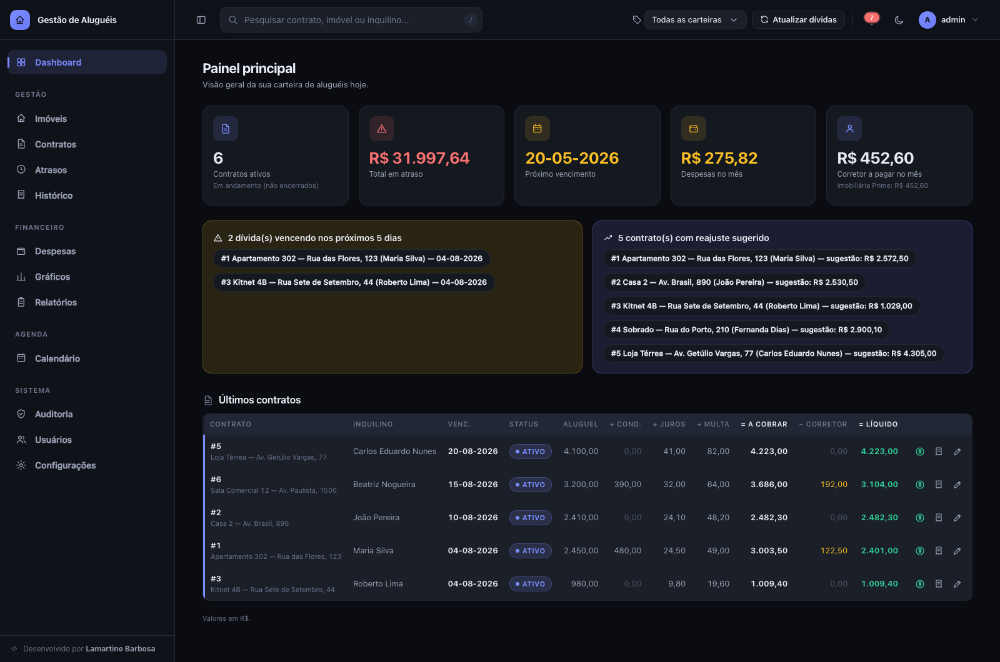
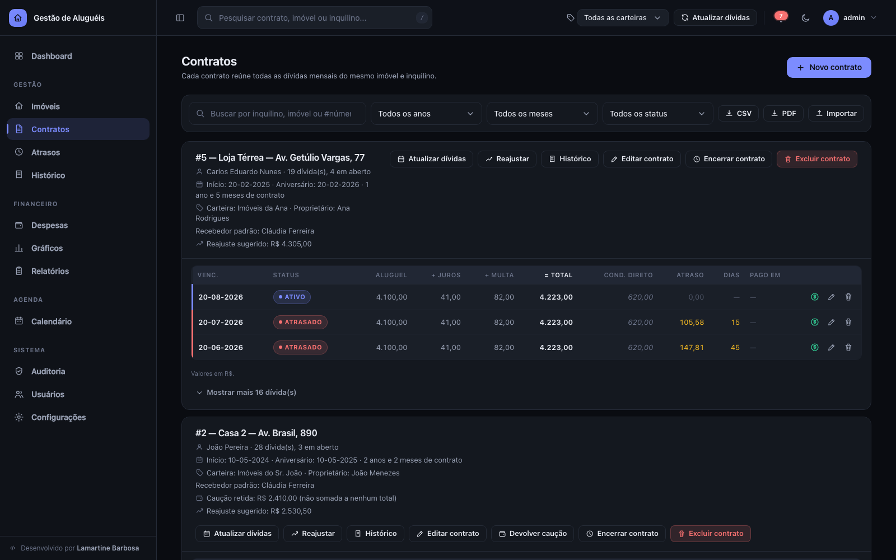
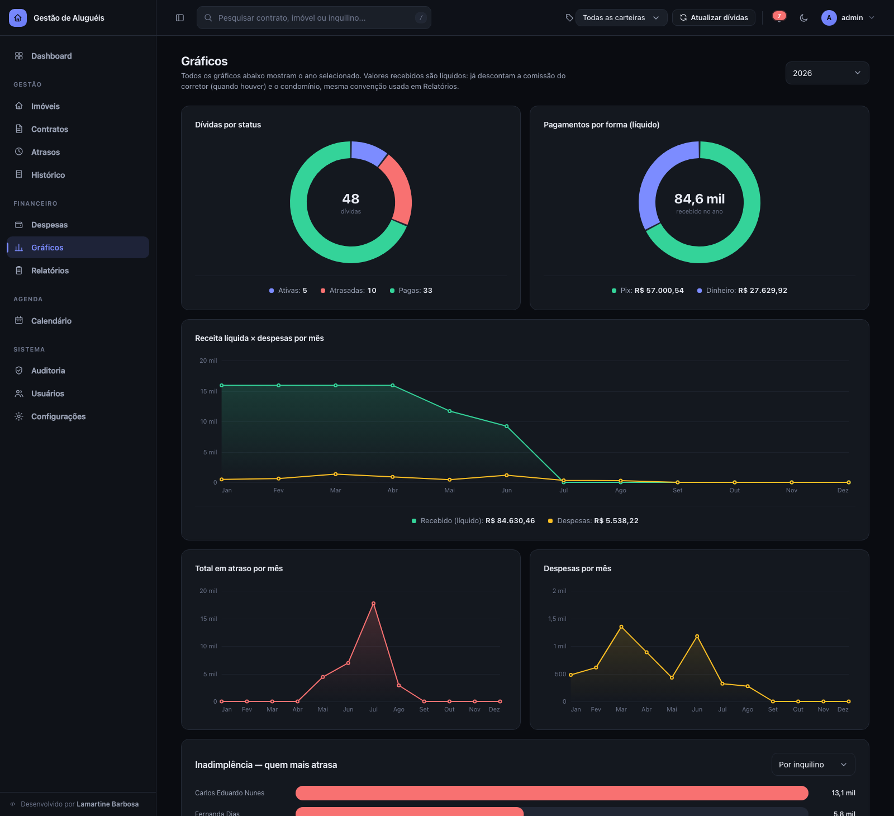
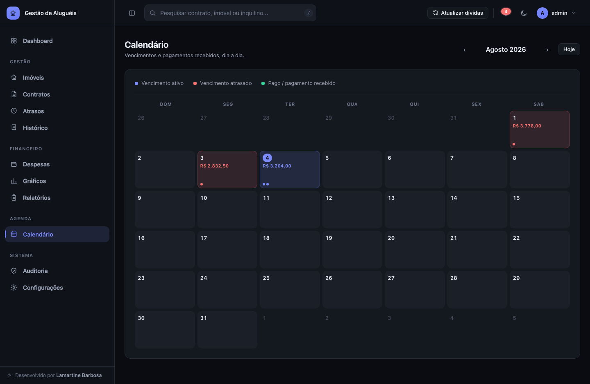
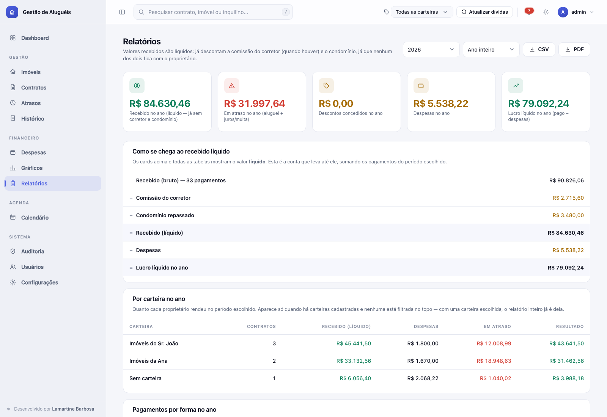

# Sistema de Gerenciamento de Aluguéis

Aplicação web para controlar imóveis, contratos de aluguel, pagamentos, atrasos, despesas e
relatórios — pensada para donos de imóveis ou pequenas imobiliárias que precisam de um lugar
central para acompanhar tudo isso, sem depender de planilhas.

Não usa nenhuma biblioteca externa, nenhum banco de dados e nenhum framework: é só
**HTML + CSS + JavaScript** no navegador e **PHP puro** no servidor, salvando tudo em
arquivos `.json`. Dá para hospedar em qualquer hospedagem compartilhada comum (Hostinger,
cPanel, etc.) e acessar de qualquer lugar pela internet.



## Índice

- [Telas do sistema](#telas-do-sistema)
- [Acesso padrão (leia antes de usar)](#acesso-padrão-leia-antes-de-usar)
- [Como rodar no seu computador](#como-rodar-no-seu-computador)
- [Como colocar no ar (hospedagem)](#como-colocar-no-ar-hospedagem)
- [O que o sistema faz](#o-que-o-sistema-faz)
- [Perguntas frequentes](#perguntas-frequentes)
- [Para quem quer entender o código](#para-quem-quer-entender-o-código)
- [Autoria](#autoria)

## Telas do sistema

> As imagens abaixo usam dados fictícios, só para demonstração.

**Contratos** — cada contrato reúne todas as dívidas mensais do mesmo imóvel e inquilino,
com as ações (pagar, editar, reajustar, anexar, encerrar) à mão em cada linha.



**Gráficos** — seis gráficos desenhados em `<canvas>` puro, todos referentes ao ano
escolhido no seletor. Passar o mouse mostra os valores de cada mês.



**Calendário** — vencimentos e pagamentos dia a dia, com o fundo da célula colorido pelo
status, para dar para escanear o mês inteiro de relance.



**Relatórios** — totais do ano, mês a mês e comparativo entre anos, com exportação em CSV.
Aqui no tema claro, que o sistema inteiro acompanha.



**Login**


## Acesso padrão (leia antes de usar)

Na primeira vez que o sistema roda, ele cria automaticamente um usuário administrador com:

```
Usuário: admin
Senha:   12345678
```

> ⚠️ **Troque essa senha imediatamente após o primeiro login.** Vá em **Configurações →
> Conta do administrador**, informe a senha atual (`12345678`) e cadastre um usuário e senha
> só seus. Enquanto isso não for feito, qualquer pessoa que souber a URL do sistema e essas
> credenciais padrão consegue entrar.

Não existe recuperação de senha por e-mail (o sistema não envia e-mails). Se esquecer a
senha depois de trocada, é preciso apagar o arquivo `data/auth.json` no servidor para que
ele volte a ser recriado com o padrão `admin` / `12345678` no próximo acesso.

## Como rodar no seu computador

Pré-requisito: ter o **PHP instalado** (versão 7.4 ou mais nova). Para verificar, abra o
terminal e digite `php -v`.

1. Baixe/clone este repositório
2. Abra o terminal na pasta do projeto
3. Rode:
   ```bash
   php -S localhost:8000
   ```
4. Acesse `http://localhost:8000` no navegador
5. Faça login com `admin` / `12345678` (veja o aviso acima)

Não precisa instalar nada com `npm`, `composer` ou qualquer outro gerenciador de pacotes —
o projeto não tem dependências.

> Nota: o servidor embutido do PHP (`php -S`) ignora o arquivo `.htaccess`, então localmente
> a pasta `data/` não fica bloqueada por URL. Isso só funciona de verdade com Apache (veja a
> seção de hospedagem abaixo).

## Como colocar no ar (hospedagem)

Este sistema foi feito para hospedagem compartilhada comum com **PHP + Apache** (cPanel,
Hostinger, etc.) — não precisa de VPS nem de conhecimento avançado de servidor.

1. **Envie os arquivos**: copie a pasta inteira do projeto (`index.html`, `index.js`,
   `ui.js`, `css/`, `api/`, `data/`, `contratos/`) para a hospedagem, mantendo a mesma
   organização de pastas
2. **Acesse pelo navegador** e faça login com `admin` / `12345678`
3. **Troque a senha na hora**, como explicado na seção acima
4. **Gere uma chave de segurança própria**: vá em **Configurações → Segurança** e clique em
   "Gerar novo COOKIE_SECRET" (protege o cookie de login contra falsificação). Também dá
   pra fazer manualmente, abrindo `api/config.php` e trocando o valor de `COOKIE_SECRET`
5. **Confirme que os dados estão protegidos**: tente acessar
   `https://seusite.com/data/dados.json` diretamente no navegador — o servidor deve
   recusar o acesso (erro 403). Isso só funciona em Apache com `.htaccess` habilitado
   (`AllowOverride All`), que é o padrão na maioria das hospedagens compartilhadas

## O que o sistema faz

A navegação fica numa **sidebar vertical fixa** (recolhível, e que vira gaveta no celular),
com as 12 telas agrupadas em 5 blocos. No topo há um **header** com busca global, seletor de
carteira (só aparece se você administra imóveis de mais de um proprietário — veja abaixo),
botão de atualizar dívidas, notificações (que espelham os alertas do Dashboard), alternância
de tema claro/escuro e o menu do usuário.

**Como o dinheiro é contado (leia isto primeiro)**

O sistema trabalha com **dois totais**, e eles não são a mesma coisa:

| | Conta | O que é |
|---|---|---|
| **Total a cobrar** | aluguel − desconto + juros + multa + condomínio | o que o **inquilino deve** |
| **Total líquido** | total a cobrar − comissão do corretor − condomínio | o que **sobra para você** |

A comissão do corretor e o condomínio **subtraem**, porque são repassados: o dinheiro passa
pela sua mão mas não fica com você. A diferença entre os dois é que o condomínio é cobrado
do inquilino (entra no total a cobrar e sai de novo no líquido), enquanto a comissão nunca é
cobrada dele — sai só do seu lado.

A **comissão do corretor** é sempre um percentual do **aluguel**, e só dele: condomínio,
juros, multa e valores em atraso não entram nessa base. Quanto pagar a cada corretor aparece
no card "Corretor a pagar no mês" (Dashboard) e na tabela "Comissão de corretores no ano"
(Relatórios, também no CSV).

O **condomínio** aparece em dois momentos. No contrato você diz se cobra junto com o aluguel
ou se o inquilino paga direto. E, **toda vez que registra um pagamento**, o sistema pergunta
se o condomínio veio junto naquele dinheiro — o padrão é **não**. Quando você responde que
veio, o valor sugerido sobe e o condomínio é descontado do líquido, porque será repassado.

Por isso, no dia a dia, **o líquido de um pagamento é o que você recebeu menos o que vai
para o corretor**.

Se você não usa corretor nem condomínio, nada disso aparece: a tela mostra um **Total** só.

**Dashboard**

- **Dashboard** — quantos contratos estão em andamento (ou seja, ainda não encerrados),
  quanto está em atraso no total, próximo vencimento, despesas lançadas no mês, um alerta (laranja) para dívidas que vencem nos
  próximos 5 dias e um alerta (azul, para não se confundir com o de vencimento) para
  contratos no "aniversário" de reajuste. Cada item dentro dos alertas é clicável: no de
  vencimento leva direto para o contrato na aba Contratos; no de reajuste abre direto o
  reajuste já com o valor sugerido preenchido

**Cadastros**

- **Imóveis** — cadastro simples de imóveis (uma lista de descrições, ex: "Apartamento
  302 - Rua das Flores #123"), usado como seletor ao criar/editar um contrato — evita
  digitar o mesmo endereço toda vez e reduz erro de digitação. Editar a descrição de um
  imóvel já cadastrado atualiza automaticamente os contratos que já usavam o nome antigo.
  Cada imóvel pode ser vinculado a uma **carteira** (proprietário), veja abaixo
- **Contratos** — cada contrato (imóvel + inquilino) aparece como um card, identificado por
  um número sequencial único (`#1`, `#2`...), com todas as suas dívidas (uma por mês) numa
  **tabela**: os rótulos aparecem uma vez só no cabeçalho e as colunas ficam alinhadas entre
  os meses, na ordem em que a conta é feita (aluguel → acréscimos → desconto → total a
  cobrar → comissão do corretor → total líquido). Só entram as colunas que aquele contrato
  usa de verdade. Ao criar um contrato, informe a data de início e o dia de pagamento (1-31); se a
  data de início já passou, o sistema gera automaticamente uma dívida para cada mês em
  atraso até hoje, tudo dentro do mesmo contrato. Registrar pagamento em um clique por
  dívida, anexar o contrato assinado (PDF/JPG/PNG) e reajustar o valor do aluguel (atualiza
  as dívidas em aberto, preserva o histórico das já pagas). Os campos Juros e Multa são
  digitados em percentual (%) do aluguel, pré-preenchidos com a taxa configurada em
  Configurações, e convertidos para R$ ao salvar. Opcionalmente, associe um corretor
  (escolhido de uma lista de pessoas cadastrada em Configurações + percentual, padrão 5%)
  — a comissão não é cobrada do inquilino, mas é deduzida do seu total líquido. Também é possível informar uma caução (valor retido do inquilino) — fica só
  como anotação visível no card, nunca soma em nenhum total, já que em teoria é devolvida no
  final; um botão "Devolver caução" registra quando isso acontece (data e valor), também sem
  afetar nenhum total. Um botão "Atualizar dívidas" (individual ou global, no topo do
  sistema) gera o próximo mês de cada contrato — roda sozinho, silenciosamente, toda vez que
  o sistema é aberto, então as dívidas ficam sempre em dia sem precisar clicar em nada.
  Contratos ativos que passaram 1 ano desde o último reajuste (ou desde o início, se nunca
  reajustados) mostram um aviso de "reajuste sugerido" com um valor calculado a partir de um
  percentual configurável (sem consultar nenhum índice real como IGP-M/IPCA — o sistema não
  acessa a internet). Quando um inquilino deixa o imóvel, "Encerrar contrato" para a geração
  automática de novas dívidas mensais sem apagar nada do histórico (pode ser revertido depois)

  Em cada dívida vencida aparecem o valor em atraso e **há quantos dias** ela está vencida

**Financeiro**

- **Registrar pagamento** — o valor sugerido é o **total a cobrar da parcela sem o
  condomínio** (que por padrão o inquilino paga direto). Duas coisas ficam de fora de
  propósito, porque cobrar ou não cada uma é decisão sua: o acréscimo de juros/multa por
  atraso, que aparece num aviso com o botão "Somar ao valor", e o condomínio, no campo
  "Recebeu o condomínio junto?". Uma prévia mostra na hora quanto fica com você.
  "Quem recebeu" é obrigatório.
  Receber **menos** que o sugerido é permitido e **quita a parcela inteira** do mesmo jeito,
  já que a quitação é sempre da parcela toda; o valor recebido é o que fica no histórico e
  no recibo
- **Atrasos** — lista separada só das dívidas vencidas, com juros, multa e dias de atraso
  calculados automaticamente conforme a taxa configurada
- **Histórico** — todos os pagamentos já registrados, com busca por texto (imóvel,
  inquilino, forma de pagamento, quem recebeu, observação), filtro por contrato e por ano,
  contador com o total somado, lista paginada de 20 em 20 e **exportação em CSV que respeita
  exatamente esses filtros** (o arquivo sai completo, não só a página na tela).
  Quando o contrato tem corretor e/ou condomínio, mostra também o "valor líquido" (o que
  efetivamente fica com o proprietário, descontando o que só passa pela mão dele). Cada
  pagamento tem um botão **Recibo**, que gera o recibo em PDF (veja abaixo)
- **Despesas** — cadastro simples de despesas (data, descrição, valor), opcionalmente
  ligadas a um contrato ou avulsas, com busca, filtro por ano e mês, lista paginada,
  edição e exclusão por item e exportação em CSV. Três indicadores no topo (total do
  período, total do ano e média mensal) e um gráfico de barras com o total de cada mês.
  O formulário de lançamento fica ao lado da lista no computador e logo acima dela no
  celular, para não ficar no fim da página. Também aparecem no Dashboard, em Relatórios
  (com "lucro líquido" = pago menos despesas) e em Gráficos
- **Gráficos** — seis gráficos do ano escolhido no seletor (padrão: ano atual): dívidas por
  status, pagamentos por forma (Dinheiro/Pix), receita líquida × despesas mês a mês, total
  em atraso por mês, despesas por mês e um ranking de inadimplência (top 6 por inquilino ou
  por imóvel). Passar o mouse mostra os valores do mês. Os valores de "recebido" são
  líquidos, mesma convenção de Relatórios — o total em atraso continua com o valor cheio
  devido, já que é dívida em aberto, não receita
- **Relatórios** — fecha **o ano ou um mês** (dois seletores no topo): a conta aberta de
  como se chega ao recebido líquido (bruto − comissão do corretor − condomínio − despesas),
  quebra por carteira/proprietário, por forma de pagamento e por corretor, tabela mês a mês
  com os 12 meses do ano, e um comparativo que vira "o mesmo mês em cada ano" quando você
  filtra um mês. Exporta tudo em **CSV ou PDF**. Todo valor "recebido" mostrado aqui é
  líquido — já descontando a comissão do corretor e o condomínio de cada pagamento

**Agenda**

- **Calendário** — grade mensal mostrando vencimentos e pagamentos dia a dia, com o fundo
  da célula inteira colorido conforme o status do dia (mais fácil de escanear o mês do
  que só pontinhos pequenos) e o valor total dos vencimentos de cada dia. No topo, três
  indicadores do mês que está na tela: a cobrar, recebido (líquido) e vencido e não pago.
  Clicar num dia abre o detalhe — os vencimentos na mesma tabela usada em Contratos, com
  os botões de pagar, gerar recibo e editar à mão, e os pagamentos recebidos logo abaixo

**Sistema**

- **Auditoria** — histórico dos eventos principais (contrato criado/editado/excluído/
  encerrado, caução devolvida, pagamento registrado, despesa lançada/editada, imóvel
  editado, usuário adicionado/removido, chave de segurança regenerada), com quem fez e
  quando. Edições de contrato, dívida, despesa e reajuste mostram um diff campo a campo
  (valor antigo → novo). Filtros por ano, mês e usuário
- **Usuários** — tudo que é acesso ao sistema, numa tela própria: sua conta (trocar
  usuário e senha), os outros administradores (adicionar e remover, sempre confirmando sua
  senha — e não dá para remover a si mesmo nem o último usuário) e a geração de uma nova
  chave `COOKIE_SECRET` pelo próprio site
- **Configurações** — taxas de juros/multa, valores padrão, percentual de reajuste
  sugerido, cadastro de pessoas (recebedores/corretores), **carteiras (proprietários)**,
  **texto do recibo**, backup completo (exportar/importar) e zona de perigo (excluir todos
  os dados)

**Recibo em PDF**

Todo pagamento tem um botão **Recibo**, que abre o recibo já formatado em A4 numa aba nova,
com a janela de impressão do navegador aberta — é só escolher "Salvar como PDF". O botão
aparece na linha da dívida em Contratos, em cada pagamento da aba Histórico e no modal de
histórico de um contrato.

O **texto** do recibo é seu: edite em **Configurações > Recibo** (título, cidade, corpo e
rodapé). Você só escreve o texto — todos os dados vêm do sistema, através de **códigos**
como `{{inquilino}}`, `{{valor_pago}}` ou `{{vencimento}}`. Na hora de gerar o recibo, cada
código é trocado pelo dado real daquele pagamento.

A própria tela lista todos os códigos disponíveis, agrupados (recibo, contrato, dívida do
mês, pagamento), com uma explicação e um **exemplo de como cada um sai no papel**. Clicar em
um código insere ele no ponto onde o cursor estava. Um botão "Ver prévia" abre um recibo de
teste com o texto que está na tela (mesmo sem salvar), e "Restaurar texto padrão" volta ao
texto de fábrica.

Detalhes prontos: o número do recibo é gerado pelo sistema (nº do contrato + competência,
ex: `001/202608`, sempre o mesmo para o mesmo pagamento) e o valor sai também por extenso
(`{{valor_extenso}}` → "mil duzentos e cinquenta reais"), sem precisar de nada instalado.

**Administrando imóveis de terceiros (carteiras)**

Se você administra imóveis de **mais de um proprietário**, cadastre uma **carteira** para
cada um em **Configurações > Carteiras** (nome, proprietário, CPF/CNPJ e observação). Depois
é só escolher a carteira em cada imóvel e em cada contrato — quando o imóvel já tem carteira,
o contrato pega ela sozinho.

A partir da primeira carteira cadastrada, aparece um **seletor no topo do sistema**. Escolher
uma carteira ali filtra **tudo**: Dashboard, Contratos, Atrasos, Histórico, Despesas,
Gráficos, Relatórios, Calendário e as exportações passam a mostrar só aquele proprietário. A
escolha fica salva no navegador. É como se cada proprietário tivesse o próprio sistema, sem
precisar de instalações separadas.

Nada disso é obrigatório: **se você só cuida dos seus próprios imóveis, é só não cadastrar
nenhuma carteira** — o seletor nem aparece e o sistema funciona exatamente como antes.
Remover uma carteira também não apaga nada: os contratos e imóveis dela continuam
existindo, só voltam a ficar sem carteira.

**Recursos gerais**

- **Exportar/Importar** — contratos em CSV (com carteira, proprietário, corretor, comissão,
  total líquido, caução, situação do contrato e mais), histórico de pagamentos em CSV (com
  as colunas na ordem da conta: valor pago → comissão → condomínio → líquido), relatório
  anual em CSV, **relatório de contratos em PDF** e backup completo em JSON. Toda exportação
  respeita os filtros da tela, inclusive a carteira selecionada
- **PDF de contratos** — sai como um relatório impresso pelo navegador em A4 deitado,
  agrupado por contrato: cabeçalho com data e filtros aplicados, uma tabela de dívidas por
  contrato, subtotal de cada um e um total geral em forma de extrato. Quebra em páginas sem
  cortar contrato ao meio, e o texto sai selecionável (não é imagem)
- **Tema claro/escuro** — segue automaticamente o tema do seu sistema operacional até você
  escolher manualmente; a partir daí fica salvo no navegador
- **Interface responsiva** — sidebar recolhível no computador (o estado fica salvo) e
  gaveta no celular; funciona de 360px até telas grandes
- **Login protegido** — sessão de 30 dias, não desloga ao fechar o navegador. Suporta
  múltiplos usuários administradores, todos com o mesmo nível de acesso
- **Atalhos de teclado** — `N` abre um novo contrato, `/` foca a busca, `Esc` fecha
  modais e menus

## Perguntas frequentes

**Preciso de banco de dados (MySQL, etc.)?**
Não. Tudo é salvo em arquivos JSON dentro da pasta `data/`, criados automaticamente.

**Posso ter mais de um usuário administrador?**
Sim. Em **Configurações → Usuários administradores** você adiciona outros usuários (ex:
um sócio ou gerente). Todos têm o mesmo nível de acesso — não existe usuário "só leitura".
Não é possível remover a si mesmo nem remover o último usuário restante.

**O sistema manda e-mail avisando de vencimento?**
Não, essa decisão foi consciente (exigiria configurar SMTP na hospedagem, com risco de
cair em spam). O aviso de vencimento aparece só dentro do Dashboard quando você acessa
o sistema.

**Perdi a senha, e agora?**
Se existir outro usuário administrador com acesso, ele pode entrar em **Configurações →
Usuários administradores**, remover o seu usuário e cadastrar um novo. Se você for o único
usuário, veja a seção [Acesso padrão](#acesso-padrão-leia-antes-de-usar) acima — apague
`data/auth.json` no servidor para resetar para o padrão (isso remove **todos** os usuários
cadastrados, não só o seu).

**Preciso cadastrar o imóvel antes de criar um contrato?**
Sim. Vá primeiro na aba **Imóveis** e cadastre a descrição do imóvel — depois, ao criar um
contrato, ele aparece no seletor. Se tentar criar um contrato sem nenhum imóvel cadastrado,
o formulário avisa e não deixa salvar.

**A caução entra em algum cálculo?**
Não. É só uma anotação visível no card do contrato — nunca soma em nenhum total, dívida,
atraso ou relatório, já que em teoria é devolvida ao inquilino no final do contrato.
Quando isso acontece de verdade, o botão "Devolver caução" só registra data e valor,
também sem afetar nenhum total.

**O "reajuste sugerido" usa o IGP-M/IPCA de verdade?**
Não. O sistema não tem acesso à internet, então não consulta nenhum índice real. A
sugestão usa um percentual fixo configurado por você em **Configurações → Reajuste
sugerido** — ajuste esse número manualmente conforme o índice vigente que você
acompanha, e o sistema calcula o valor sugerido a partir dele.

**Administro imóveis de vários donos. Preciso de uma instalação para cada um?**
Não. Cadastre uma **carteira** por proprietário em **Configurações → Carteiras** e escolha
a carteira em cada imóvel/contrato. O seletor que aparece no topo do sistema filtra tudo
(Dashboard, Contratos, Atrasos, Histórico, Despesas, Gráficos, Relatórios, Calendário e as
exportações) pelo proprietário escolhido. Se você só cuida dos próprios imóveis, ignore:
sem carteiras cadastradas o seletor nem aparece.

**Dá para mudar o texto do recibo?**
Sim, em **Configurações → Recibo**. Você edita só o texto (título, cidade, corpo e
rodapé) — os dados vêm do sistema através de códigos como `{{inquilino}}` ou
`{{valor_pago}}`, todos listados na própria tela com explicação e exemplo. Clicar em um
código insere ele onde o cursor estava, e o botão "Ver prévia" mostra como o recibo vai
ficar antes de salvar.

## Para quem quer entender o código

### Estrutura de arquivos

```
index.html           Estrutura da página (login + sidebar + header + telas + modais)
index.js             Toda a lógica do front-end (dados, regras, renderização)
ui.js                Camada de interface: sidebar recolhível, drawer no celular,
                      menus suspensos, busca do header, notificações, abas de
                      Configurações. Não contém regra de negócio nem chamada de API.

css/tokens.css       Variáveis do design system (cores, tipografia, espaçamento,
                      raios, sombras, animações) + tema claro/escuro + utilitários
css/components.css   Componentes reutilizáveis: Button, Card, Input, Table, Badge,
                      Alert, Dropdown, Modal, Tabs, Tooltip, Pagination, Toast,
                      Skeleton, Loading, Empty state, Toolbar
css/layout.css       Casca da aplicação: sidebar fixa, header, área de conteúdo,
                      drawer no celular, responsividade e impressão
css/screens.css      Estilos específicos de cada tela (login, dashboard, contratos,
                      atrasos, timelines, despesas, gráficos, calendário, config)

api/config.php       Constantes (usuário/senha padrão, chave do cookie) e funções de
                      leitura/gravação dos arquivos data/dados.json e data/auth.json
api/auth.php         Emissão e validação do cookie de sessão
api/login.php        POST { username, password } -> autentica e emite cookie; bloqueia
                      o IP por 15min após 5 tentativas erradas seguidas
api/logout.php       POST -> limpa o cookie
api/session.php      GET -> { authenticated, username }
api/data.php         GET lê / POST grava data/dados.json (exige autenticação)
api/account.php      POST { currentPassword, newUsername, newPassword } -> troca o
                      próprio usuário/senha em data/auth.json (exige senha atual)
api/regenerate_secret.php  POST { currentPassword } -> gera um novo COOKIE_SECRET
                      aleatório e reescreve api/config.php (exige senha atual)
api/users.php         GET lista os usuários administradores; POST { action: 'add' | 'remove',
                      currentPassword, ... } adiciona ou remove outros usuários (exige a
                      própria senha atual, além de autenticação)
api/anexo.php         GET ?file=... baixa/visualiza o anexo; POST (multipart) envia um
                      novo anexo; POST { action: 'remove', file } remove um anexo
                      (exige autenticação)

data/dados.json      Imóveis, carteiras, pessoas, contratos (com dívidas e pagamentos),
                      despesas, configuração (inclusive o texto do recibo) e auditoria
                      (criado automaticamente)
data/auth.json       Lista de usuários administradores + hash de senha de cada um
                      (criado automaticamente, password_hash)
data/login_attempts.json  Contador de tentativas de login erradas por IP (criado
                      automaticamente, fora do controle de versão — puramente temporário)
data/.htaccess       Bloqueia acesso direto via URL a tudo dentro de data/

contratos/           Arquivos de contrato assinado anexados (PDF/JPG/PNG), renomeados
                      para nomedoinquilino-imovel-idcurto.ext (criado automaticamente)
contratos/.htaccess  Bloqueia acesso direto via URL a tudo dentro de contratos/
```

### Como o login funciona

O login usa um cookie de sessão assinado com HMAC-SHA256 — **não** usa `session_start()`
do PHP. Isso significa que não há estado de sessão guardado no servidor: o próprio cookie
carrega usuário + validade + assinatura, e a assinatura é validada comparando com a chave
`COOKIE_SECRET` e com a lista de usuários salva em `data/auth.json` (o usuário do cookie
precisa continuar existindo nessa lista — se for removido, a sessão é invalidada
imediatamente). O cookie dura 30 dias e é `HttpOnly` + `SameSite=Lax`.

`data/auth.json` guarda uma lista de usuários (`{ users: [{ id, username, passwordHash }] }`),
todos com o mesmo nível de acesso. Instalações antigas que tinham só `{ username,
passwordHash }` são migradas automaticamente para o novo formato no primeiro acesso,
sem exigir nenhuma ação manual.

A chave `COOKIE_SECRET` pode ser regenerada a qualquer momento pela própria interface
(**Configurações → Segurança**, exige senha atual) — o endpoint `api/regenerate_secret.php`
reescreve `api/config.php` no servidor com escrita atômica (arquivo temporário + `rename()`)
e reemite a sessão de quem gerou a chave, mas invalida a sessão de todos os outros usuários
logados no momento (a assinatura antiga deixa de bater com a chave nova).

`api/login.php` bloqueia um IP por 15 minutos depois de 5 tentativas erradas seguidas
(mesmo que a senha certa seja digitada durante o bloqueio), pra dificultar força bruta —
o contador fica em `data/login_attempts.json` (protegido pelo `.htaccess` de `data/`,
fora do controle de versão, e se limpa sozinho com o tempo). Senhas exigem no mínimo 8
caracteres. Adicionar ou remover outro usuário administrador (**Configurações → Usuários
administradores**) exige confirmar a própria senha atual, igual à troca de senha e à
geração de nova chave — são todas ações de alto impacto.

### Arquitetura geral

- **Front-end**: `index.html` + `css/` + `index.js` + `ui.js`. Aplicação de página única
  (SPA): as 12 telas (Dashboard, Imóveis, Contratos, Atrasos, Histórico, Despesas,
  Gráficos, Relatórios, Calendário, Auditoria, Usuários, Configurações) são seções que aparecem/somem
  no mesmo HTML, sem recarregar a página. A navegação fica numa **sidebar vertical fixa**
  (280px, recolhível para 76px com o estado salvo no navegador; vira gaveta no celular),
  agrupada em 5 blocos: Dashboard, Gestão, Financeiro, Agenda e Sistema. O header traz
  busca global, seletor de carteira (quando há carteiras cadastradas), atualização de
  dívidas, notificações, tema claro/escuro e menu do usuário.
- **Separação de responsabilidades no JS**: `index.js` continua dono de tudo que envolve
  dados, cálculo e API. `ui.js` só cuida de comportamento visual — ele lê o que o
  `index.js` já colocou na tela (por exemplo, os alertas do Dashboard viram o painel de
  notificações do header) e nunca calcula nada por conta própria.
- **Backend**: PHP puro em `api/`, sem framework. Cada endpoint é um arquivo `.php`
  independente. Toda a comunicação front-end ↔ backend é via `fetch()` com JSON.
- **Dados**: um único arquivo `data/dados.json` com tudo (imóveis, carteiras, pessoas,
  contratos, despesas, configuração, auditoria) + `data/auth.json` separado para login,
  ambos protegidos contra acesso direto via `.htaccess`.
- **Sistema de design**: `css/tokens.css` concentra toda a identidade visual — escala
  tipográfica única (`--text-2xs` a `--text-3xl`, piso de 11px, fonte Inter com fallback
  para a fonte do sistema), escala de espaçamento em múltiplos de 8 (`--space-1` a
  `--space-9`), raio padrão de 14px, sombras, durações e curvas de animação. Nenhum
  componente digita cor, tamanho ou espaçamento direto: tudo sai de uma variável, então
  mudar a aparência do sistema inteiro é mudar esse arquivo. `css/components.css` traz a
  biblioteca de componentes reutilizáveis, e um pequeno conjunto de utilitários
  (`.text-danger`, `.is-current`, `.mt-sm`/`.mt-md`, `.bg-accent`/`.bg-danger`/
  `.bg-success`) substitui estilos inline nos templates gerados via JS.

  > **Atenção ao mexer nas cores**: `--accent`, `--success`, `--danger`, `--warn`,
  > `--border`, `--text`, `--text-dim` e `--text-faint` são lidos pelo JavaScript dos
  > gráficos (`cssVar()` em `index.js`). Precisam continuar existindo nos dois temas, e
  > `--success`/`--danger`/`--warn` precisam ser **hex de 6 dígitos** — o desenho dos
  > gráficos de linha concatena transparência no fim da cor (`cor + '26'`).

### Gráficos

Todos os gráficos são desenhados à mão em `<canvas>`, sem nenhuma biblioteca. Pontos
importantes de quem for mexer neles:

- **Um seletor de ano comanda a aba inteira** (`#graficoAno`, padrão = ano atual). Todos os
  seis gráficos mostram o ano escolhido, igual à aba Relatórios.
- **Resolução**: `setupCanvas()` multiplica a resolução do canvas pelo `devicePixelRatio` e
  escala o contexto, para os gráficos não ficarem borrados em tela retina. A altura lógica
  original do canvas fica memorizada em `dataset.alturaLogica`, já que o atributo `height`
  passa a guardar a resolução física.
- **Eixos**: `passoRedondo()` escolhe um passo "bonito" (1, 2, 5, 10, 20, 50...) para as
  linhas de grade, e `formatCompacto()` encurta os valores ("12,5 mil"). Os rótulos dos
  meses das pontas são alinhados para dentro, para não serem cortados na borda.
- **Interação**: passar o mouse sobre um gráfico de linha ou de barras mostra os valores
  daquele mês. Os handlers usam `canvas.onmousemove = ...` (propriedade, não
  `addEventListener`) de propósito: o gráfico é redesenhado a cada render, e com
  `addEventListener` os handlers se acumulariam.

### Calendário

A grade sempre fecha semanas completas: começa com os últimos dias do mês anterior e
termina com os primeiros dias do mês seguinte. Essas células de preenchimento aparecem
esmaecidas, numeradas de verdade (1, 2, 3... do mês seguinte) e não são clicáveis nem
recebem cor de status — só os dias do mês corrente respondem a clique e mostram valores.

### As contas do dinheiro

Cinco funções em `index.js` concentram tudo que envolve valor. Se precisar mexer numa regra
financeira, é em uma delas — nenhuma tela recalcula nada por conta própria:

| Função | O que devolve |
|---|---|
| `condominioCobrado(d)` | o condomínio que a dívida cobra do inquilino (0 quando ele paga direto) |
| `condominioNoPagamento(d, p)` | o condomínio que veio naquele pagamento — 0 quando não veio (o padrão). Pagamentos gravados antes desse campo existir herdam a regra da dívida |
| `calcTotal(d)` | **total a cobrar**: `aluguel − desconto + juros + multa + condomínio cobrado` |
| `comissaoCorretor(c, d)` | percentual do **aluguel** da dívida (0 sem corretor). É o único lugar que define a base da comissão |
| `deducoesDivida(c, d)` | comissão + condomínio cobrado — o que é repassado a terceiros |
| `totalLiquidoDivida(c, d)` | projeção: total a cobrar menos as deduções |
| `valorLiquidoPagamento(c, d, p)` | o que sobrou de fato: `pago − comissão − condomínio recebido junto`. Como o padrão é o inquilino pagar o condomínio direto, quase sempre é só `pago − comissão` |

Duas consequências que vale ter em mente ao mexer nisso:

- **O valor sugerido no pagamento é `d.total` menos o condomínio**, e sem somar
  `calcAtrasoAtual()`. Tanto o atraso quanto o condomínio ficam em controles à parte no
  modal, porque cobrar ou não cada um é decisão de quem recebe. Registrar um valor menor
  **quita a parcela inteira** do mesmo jeito (`d.pago = true`), já que a quitação é sempre
  da parcela toda.
- **`calcAtrasoAtual()` usa `d.total`** como base dos juros/multa — ou seja, o valor cheio
  devido pelo inquilino, não o líquido. Trocar isso mudaria todos os totais de Atrasos,
  Relatórios e Gráficos.

### Recibo

O recibo é gerado como **HTML impresso pelo navegador**, não em canvas: o texto sai nítido
e selecionável no PDF. O relatório de contratos usa o mesmo caminho — os dois passam por
`abrirJanelaImpressao()`, a única função do sistema que abre janela de impressão.

- Um recibo é sempre de **um pagamento** — identificado pelo par (`dividaId`, índice do
  pagamento dentro de `divida.pagamentos`), já que pagamentos não têm `id` próprio.
  Sem índice (botão na linha da dívida), usa o pagamento mais recente.
- `dadosRecibo(contrato, divida, pagamento, indice)` monta o objeto `código → valor`, e
  `aplicarTemplateRecibo()` troca cada `{{codigo}}` no texto. Código desconhecido vira
  texto vazio, para não sair `{{xyz}}` impresso no papel.
- `CODIGOS_RECIBO` é o catálogo (grupo + código + descrição) que desenha a tela de
  Configurações. **Toda chave listada ali precisa ser produzida por `dadosRecibo()`** —
  é o que mantém a documentação da tela e o gerador em sincronia. A coluna de exemplos
  da tela chama a própria `dadosRecibo()`, com o pagamento mais recente do sistema (ou um
  exemplo fictício, se ainda não houver nenhum).
- O texto é escapado antes de entrar no HTML e renderizado com `white-space: pre-wrap`,
  então as quebras de linha valem como digitadas e nada que o usuário escreva vira markup.
- `valorPorExtenso()` converte o valor em palavras sem nenhuma biblioteca, seguindo as
  regras do português: cem/cento, "mil" (não "um mil"), "um milhão **de** reais" mas "dois
  milhões e quinhentos mil reais", "e" antes do último grupo quando ele é menor que 100 ou
  múltiplo de 100.
- `{{dias_atraso}}` é calculado contra a **data do pagamento**, não contra hoje — um recibo
  reimpresso meses depois precisa continuar dizendo o que valia na época.

### Modelo de dados

Um **contrato** representa um acordo de aluguel (imóvel + inquilino) e guarda dentro de
si uma lista de **dívidas** — uma por mês/ciclo de cobrança. Isso permite lançar um
contrato antigo com vários meses em aberto de uma vez, tudo dentro do mesmo contrato, em
vez de criar vários contratos separados.

#### Contrato (cada item do array `contratos` em `data/dados.json`)

| Campo           | Tipo               | Descrição                                                |
|------------------|--------------------|------------------------------------------------------------|
| `id`             | string             | Gerado no front-end (`uuid()`)                              |
| `numero`         | number             | Número sequencial único para identificar o contrato (`max(números existentes) + 1`), gerado automaticamente na criação. Sem relação com `id` |
| `imovel`         | string             | Descrição do imóvel — escolhida da lista cadastrada na aba "Imóveis" |
| `carteiraId`     | string             | Carteira (proprietário) a que este contrato pertence — `''` = sem carteira (imóvel próprio). Ver "Carteiras" abaixo |
| `inquilino`      | string             | Nome do inquilino                                           |
| `quemRecebeu`    | string             | Recebedor padrão sugerido ao registrar pagamento — nome escolhido da lista de "pessoas" (ou vazio) |
| `dataInicio`     | string `AAAA-MM-DD`| Data de início do contrato, informada na criação             |
| `diaPagamento`   | number             | Dia do mês do pagamento (1-31), informado na criação         |
| `aluguel`        | number             | Valor de aluguel **padrão atual** — usado ao gerar novas dívidas (via "Atualizar dívidas") e atualizado pelo reajuste. Cada dívida guarda seu próprio valor, então mudar isto não altera dívidas já existentes |
| `desconto`, `juros`, `multa`, `condominio` | number | Valores padrão atuais, mesma lógica do aluguel |
| `anexoContrato`  | string ou null     | Nome do arquivo do contrato assinado anexado (em `contratos/`), ou `null` |
| `corretorNome`   | string             | Nome do corretor associado a este contrato (vazio = sem corretor) |
| `corretorPercentual` | number         | Percentual **do aluguel** (e só dele: condomínio, juros, multa e atraso não entram na base) que vai para o corretor. Não é cobrado do inquilino — não altera o `total` de nenhuma dívida — mas é **deduzido do total líquido**, porque é dinheiro que será pago a ele |
| `condominioDireto` | boolean          | Padrão do contrato, copiado para cada dívida gerada (ver a tabela de dívida abaixo) |
| `caucao`         | number             | Valor de caução retido (opcional) — só informativo, nunca entra em nenhum cálculo/total |
| `caucaoDevolvida` | boolean           | Se a caução já foi devolvida (registrado pelo botão "Devolver caução") |
| `dataCaucaoDevolvida` | string `AAAA-MM-DD` ou null | Data da devolução, ou `null` |
| `valorCaucaoDevolvida` | number ou null | Valor devolvido (pode ser diferente do `caucao` original), ou `null` |
| `dataUltimoReajuste` | string `AAAA-MM-DD` | Data do último reajuste aplicado (ou `dataInicio`, se nunca reajustado) — usada para calcular o "aniversário" de reajuste sugerido (1 ano depois) |
| `encerrado`      | boolean            | Se `true`, o sistema não gera mais novas dívidas mensais para este contrato (nem manual nem automaticamente), mas nada é apagado — histórico e dívidas existentes continuam intactos |
| `dataEncerramento` | string `AAAA-MM-DD` ou null | Data em que o contrato foi encerrado, ou `null` |
| `criadoEm`       | number (timestamp) | Data de criação do contrato                                  |
| `dividas`        | array              | Lista de dívidas (ver abaixo) — pelo menos uma                |

#### Dívida (cada item de `contrato.dividas`)

| Campo             | Tipo              | Descrição                                             |
|--------------------|------------------|--------------------------------------------------------|
| `id`               | string            | Gerado no front-end (`uuid()`)                          |
| `vencimento`       | string `AAAA-MM-DD` | Data de vencimento desta dívida (deste mês)           |
| `aluguel`          | number            | Valor do aluguel mensal desta dívida (snapshot — não muda se o contrato for reajustado depois de paga) |
| `desconto`         | number            | Desconto aplicado                                       |
| `juros`            | number (R$)       | Juros já lançados nesta dívida — na criação do contrato é digitado em % do aluguel e convertido para R$; na edição de uma dívida existente é digitado direto em R$ |
| `multa`            | number (R$)       | Multa já lançada nesta dívida — mesma lógica do `juros` acima |
| `condominio`       | number            | Valor do condomínio                                     |
| `condominioDireto` | boolean           | `true` = o inquilino paga o condomínio direto, então ele **não** entra no total a cobrar (o dinheiro nunca passa pelo proprietário); `false` = cobrado junto com o aluguel. Herdado do contrato ao gerar as dívidas mensais. Se ele foi de fato recebido em cada pagamento é outra coisa — ver `condominioRecebido` no pagamento |
| `total`             | number            | **Total a cobrar**: `aluguel - desconto + juros + multa + condomínio cobrado` (`condominioCobrado()` devolve 0 quando `condominioDireto`) |
| `valorAtrasoBase`  | number            | Atraso herdado/manual, somado ao atraso calculado       |
| `observacao`       | string            | Observações livres desta dívida                         |
| `pago`             | boolean           | Se esta dívida já foi paga                              |
| `dataPagamento`    | string ou null    | Data do pagamento registrado                             |
| `pagamentos`       | array             | Histórico de pagamentos desta dívida (ver abaixo)        |
| `criadoEm`         | number (timestamp)| Usado para ordenar "dívidas recentes" no Dashboard       |

**Total líquido** (calculado, não é um campo salvo): `total − comissão do corretor −
condomínio cobrado`, via `totalLiquidoDivida()`. É o que sobra para o proprietário. O
`total` salvo continua sendo o que o inquilino deve — ver "Como o dinheiro é contado".

**Status da dívida** (calculado, não é um campo salvo): `pago` se `pago=true`;
senão `atrasado` se hoje > vencimento; senão `ativo`. O status do contrato como um todo
não existe — cada dívida tem o seu.

#### Pagamento (cada item de `divida.pagamentos`)

| Campo         | Tipo   | Descrição                                  |
|---------------|--------|----------------------------------------------|
| `data`        | string `AAAA-MM-DD` | Data em que o pagamento foi feito     |
| `desconto`    | number | Desconto aplicado a este pagamento (opcional) |
| `motivoDesconto` | string | Motivo do desconto — só relevante quando `desconto > 0`, campo dedicado separado da `observacao` genérica |
| `valor`       | number | Valor pago (já descontado, se houver desconto)|
| `forma`       | string | Forma de pagamento: `Dinheiro` ou `Pix`       |
| `quemRecebeu` | string | Quem recebeu — nome escolhido da lista de "pessoas". **Obrigatório** |
| `condominioRecebido` | boolean | Se o condomínio veio junto neste pagamento. Perguntado toda vez, com **Não** como padrão. Ausente em pagamentos gravados antes deste campo existir — nesse caso `condominioNoPagamento()` cai na regra da dívida, e nenhum valor histórico muda |
| `observacao`  | string | Observação do pagamento                       |

O "valor líquido" (`valorLiquidoPagamento()` em `index.js`) não é salvo — é calculado na
hora: `valor - (aluguel da dívida × corretorPercentual/100, se houver corretor) -
(condomínio da dívida, só se `condominioRecebido`)`. Como o padrão é o inquilino pagar o
condomínio direto, na prática costuma ser `valor − comissão do corretor`. No Histórico aparece ao lado do valor bruto; em Relatórios e nos
gráficos "Pagamentos por forma" e "Receita mensal", todo valor "recebido" já é esse valor
líquido (não mostra o bruto separadamente). A "Evolução do total em atraso" é a exceção —
continua com o valor cheio devido, já que representa dívida em aberto, não receita.

#### Migração automática de formatos antigos

O front-end migra dados antigos automaticamente ao carregar, sem exigir nenhuma ação
manual e sem perder informação:

- Contratos "planos" (um vencimento só, sem `dividas`) — agrupados por `imovel` +
  `inquilino` + `dataInicio` + `diaPagamento` num único contrato com várias dívidas
- Contratos sem `numero` — recebem um número sequencial, na ordem de criação
- Array `corretores` antigo — renomeado para `pessoas` (mesmo formato `{ id, nome }`)
- Ausência de `pessoas`, `despesas`, `imoveis` ou `carteiras` — inicializados como listas
  vazias (sem `carteiras`, o sistema roda no modo de um proprietário só)
- Ausência de `config.recibo` (ou um `recibo` pela metade) — completado com o texto padrão
  do recibo, campo a campo
- Ausência de `condominioDireto` em contratos/dívidas antigos — `undefined` é falso, então
  o condomínio continua sendo tratado como cobrado junto com o aluguel, que é como sempre
  foi. Nenhum valor já lançado muda

#### Configuração (`config` em `data/dados.json`)

| Campo               | Padrão | Descrição                                            |
|---------------------|--------|--------------------------------------------------------|
| `taxaJurosMensal`   | 1 (%)  | Taxa de juros mensal aplicada sobre o total em atraso, e também percentual padrão do campo "Juros" ao criar um novo contrato |
| `taxaMultaPercent`  | 2 (%)  | Multa fixa aplicada uma vez que o contrato atrasa, e também percentual padrão do campo "Multa" ao criar um novo contrato |
| `corretorPercentualPadrao` | 5 (%) | Percentual do corretor pré-preenchido ao criar um novo contrato |
| `percentualReajusteSugerido` | 5 (%) | Usado para calcular o valor de aluguel sugerido quando um contrato chega no aniversário de reajuste (sem consultar índice externo real) |
| `recibo`            | objeto | Texto do recibo: `{ titulo, cidade, corpo, rodape }`. Só texto — os dados entram pelos códigos `{{...}}` na hora de gerar (ver "Recibo" abaixo). Padrão em `RECIBO_PADRAO` (`index.js`) |

Cálculo do atraso atual (função `calcAtrasoAtual` em `index.js`): se o contrato já está
atrasado, soma `valorAtrasoBase` + (`total` × `taxaJurosMensal`/100 × meses de atraso)
+ (`total` × `taxaMultaPercent`/100).

#### Pessoas (array `pessoas` em `data/dados.json`)

Lista reutilizável de nomes cadastrados (`{ id, nome, carteiraId }`), gerenciada em
Configurações. Alimenta os seletores "Quem recebe" (contrato e pagamento) e "Corretor" — um
mesmo nome cadastrado pode ser usado nos dois papéis, evitando digitar toda vez. Remover uma
pessoa da lista não afeta contratos/pagamentos que já usam aquele nome; renomear atualiza os
que usavam o nome antigo.

O `carteiraId` das pessoas segue uma regra **própria**, diferente da de contratos e imóveis:
vazio significa "aparece em todas as carteiras" (o padrão, para quem atende o sistema
inteiro), e preenchido restringe a pessoa aos seletores daquela carteira. É `pessoasVisiveis()`
que aplica isso.

#### Imóveis (array `imoveis` em `data/dados.json`)

Lista reutilizável de imóveis cadastrados (`{ id, nome, carteiraId }`, onde `nome` é a
descrição livre do imóvel e `carteiraId` é a carteira/proprietário dele, `''` quando não
há), gerenciada na aba "Imóveis". Alimenta o seletor de imóvel ao criar/editar um
contrato — que passa a mostrar só os imóveis da carteira ativa, e preenche a carteira do
contrato sozinho quando o imóvel escolhido já tem uma. Remover um imóvel da lista não
afeta contratos que já usam aquela descrição.

#### Carteiras (array `carteiras` em `data/dados.json`)

Cada carteira (`{ id, nome, proprietario, documento, observacao, criadoEm }`) agrupa os
contratos de um mesmo proprietário — o modo multi-imóvel/multi-proprietário, para quem
administra imóveis de terceiros. É opcional: com a lista vazia, o seletor do topo não
aparece, os campos "Carteira" ficam escondidos em todos os formulários e o sistema se
comporta como antes.

O filtro por carteira é aplicado num ponto só, em três funções de `index.js`:

| Função               | Substitui        | Usada em                                              |
|----------------------|------------------|---------------------------------------------------------|
| `contratosVisiveis()` | `state.contratos` | `todasDividas()`, `getFilteredContratos()`, histórico, alerta de reajuste, seletor de contrato das despesas |
| `despesasVisiveis()`  | `state.despesas`  | aba Despesas, card do Dashboard, Gráficos, Relatórios     |
| `imoveisVisiveis()`   | `state.imoveis`   | aba Imóveis e o seletor de imóvel dos contratos           |

Só **leitura para exibir ou somar** passa por elas. Escrita (criar/editar/excluir) continua
indo direto no `state`, porque aí o alvo é sempre um item específico por `id` — e por isso
"Atualizar dívidas" (global e no login) continua rodando para todos os contratos,
independente da carteira ativa: é manutenção de dados, não uma tela.

A carteira ativa fica em `carteiraAtiva` (memória) e em `localStorage` sob a chave
`aluguelApp_carteira`. Remover uma carteira não apaga nada: os contratos, imóveis e
despesas dela têm o `carteiraId` limpo e voltam a contar como "sem carteira".

#### Despesa (cada item do array `despesas` em `data/dados.json`)

| Campo         | Tipo               | Descrição                                          |
|---------------|--------------------|------------------------------------------------------|
| `id`          | string             | Gerado no front-end (`uuid()`)                        |
| `data`        | string `AAAA-MM-DD`| Data da despesa                                       |
| `descricao`   | string             | Descrição livre                                       |
| `valor`       | number             | Valor da despesa (R$)                                 |
| `contratoId`  | string ou null     | Contrato relacionado (opcional) — `null` = despesa geral, não ligada a um contrato específico |
| `carteiraId`  | string             | Carteira da despesa — só usado na despesa **geral**; com `contratoId` preenchido, a carteira é sempre a do contrato (`carteiraDaDespesa()` em `index.js`) |
| `criadoEm`    | number (timestamp) | Data de criação do lançamento                         |

Despesas são só um registro de controle — não entram no cálculo de nenhuma dívida,
total ou receita. Consultáveis por mês e por ano na aba "Despesas".

#### Auditoria (array `auditoria` em `data/dados.json`)

| Campo       | Tipo               | Descrição                                             |
|-------------|--------------------|--------------------------------------------------------|
| `id`        | string             | Identificador único do evento                          |
| `timestamp` | number (ms)        | Quando o evento aconteceu                               |
| `usuario`   | string             | Nome do usuário logado que realizou a ação              |
| `acao`      | string             | Tipo do evento — ver lista abaixo                       |
| `descricao` | string             | Texto legível do evento, mostrado na aba Auditoria      |
| `alteracoes` | array             | Diff campo a campo desta edição (ver abaixo) — `[]` quando não se aplica |

Tipos de `acao` registrados: `contrato_criado`, `contrato_editado`, `contrato_excluido`,
`contrato_reajustado`, `contrato_encerrado`, `contrato_reaberto`, `caucao_devolvida`,
`divida_editada`, `divida_excluida`, `pagamento_registrado`, `despesa_criada`,
`despesa_editada`, `despesa_excluida`, `imovel_editado`, `carteira_criada`,
`carteira_editada`, `carteira_excluida`, `usuario_adicionado`, `usuario_removido`,
`cookie_secret_regenerado`.

Cada item de `alteracoes` é `{ campo, de, para }` — o valor antigo e o novo de um campo
que realmente mudou (função `diffCampos()` em `index.js`). Usado nas edições de contrato,
dívida, despesa e reajuste, para detalhar exatamente o que mudou, além da descrição em
texto. A aba Auditoria também tem filtros por ano, mês e usuário.

Mantém só os últimos 300 eventos — os mais antigos são descartados automaticamente.

### Requisitos técnicos

- PHP 7.4+ (testado com PHP 8.5) com suporte a `setcookie()` com array de opções,
  `password_hash`/`password_verify`, `random_bytes` e a extensão `fileinfo` (para validar
  o tipo real dos arquivos anexados aos contratos) — vem habilitada por padrão na grande
  maioria das hospedagens e instalações de PHP
- Apache com `.htaccess` habilitado (`AllowOverride All`) para proteger as pastas
  `data/` e `contratos/`
- Nenhuma dependência de Node/npm/Composer
- Para anexar contratos maiores, confira os limites `upload_max_filesize` e
  `post_max_size` do PHP da sua hospedagem — hospedagens compartilhadas às vezes vêm
  com limites baixos (ex: 2MB) por padrão

### O que não foi implementado (por decisão consciente)

- **Notificações por e-mail** de vencimentos — exigiria SMTP configurado na hospedagem,
  sem garantia de entrega (cai em spam facilmente com `mail()` nativo do PHP). O alerta
  de vencimentos existe só dentro do site (Dashboard).

### Ideias para o futuro

- Papéis de permissão distintos entre usuários administradores (hoje todos têm o mesmo
  nível de acesso)
- Anexar comprovantes por pagamento (hoje só o contrato assinado é anexável)
- Registro de pagamento parcial de uma dívida
- Telefone/e-mail do inquilino, com atalho para WhatsApp
- Aplicativo instalável (PWA) com uso básico offline
- Outras ideias detalhadas em `etapas.txt`

## Autoria

Software desenvolvido por **[Lamartine Barbosa](https://github.com/Lamartine-Brasil)**.

O crédito de autoria aparece de forma discreta dentro do próprio sistema, no rodapé da
barra lateral e na tela de login, sempre com link para o GitHub do autor.
